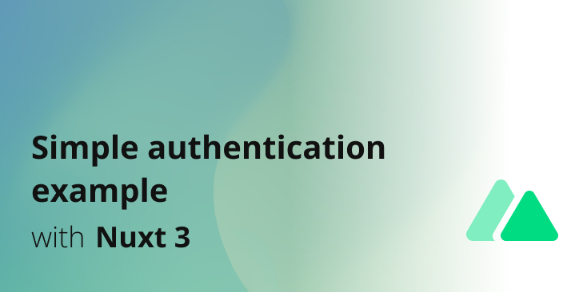

# Nuxt 3 Minimal Starter

Look at the [nuxt 3 documentation](https://v3.nuxtjs.org) to learn more.



## Features

- ⚡️ Login with email and password
- 📝 Guest, private, admin pages
- 🔥 Active session on page reload

## Setup

Make sure to install the dependencies:

```bash
# yarn
yarn install

# npm
npm install

# pnpm
pnpm install --shamefully-hoist
```

## Development Server

Start the development server on http://localhost:3000

```bash
npm run dev
```

## Production

Build the application for production:

```bash
npm run build
```

Locally preview production build:

```bash
npm run preview
```

Checkout the [deployment documentation](https://v3.nuxtjs.org/docs/deployment) for more information.
